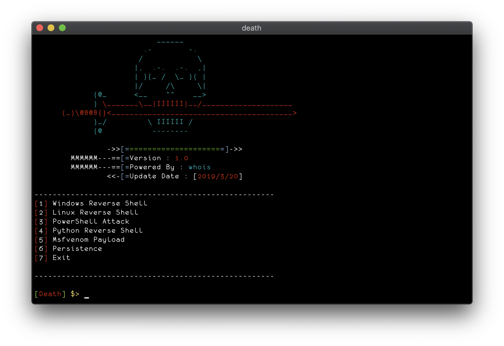
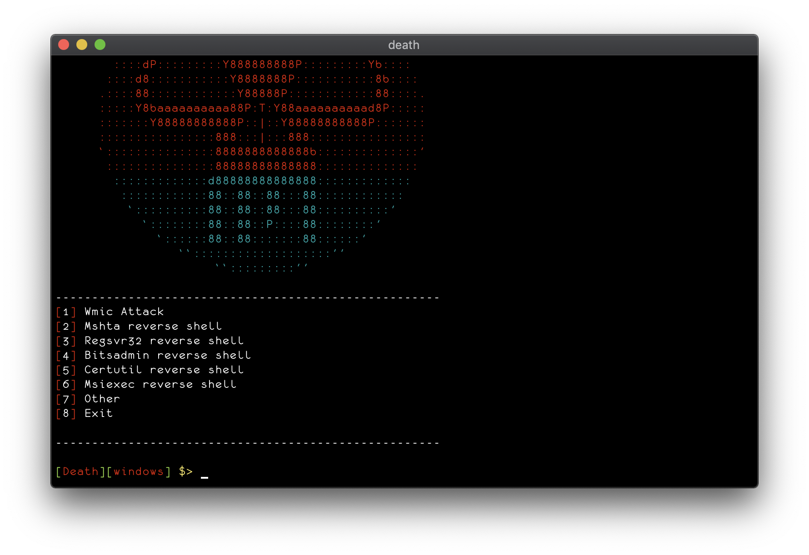
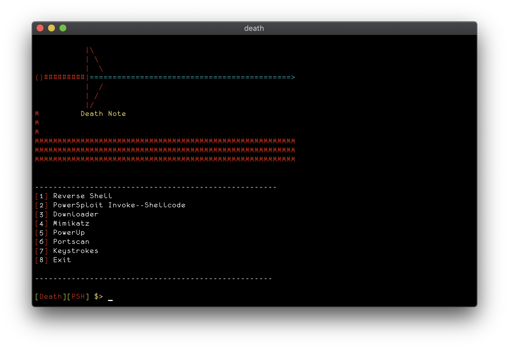
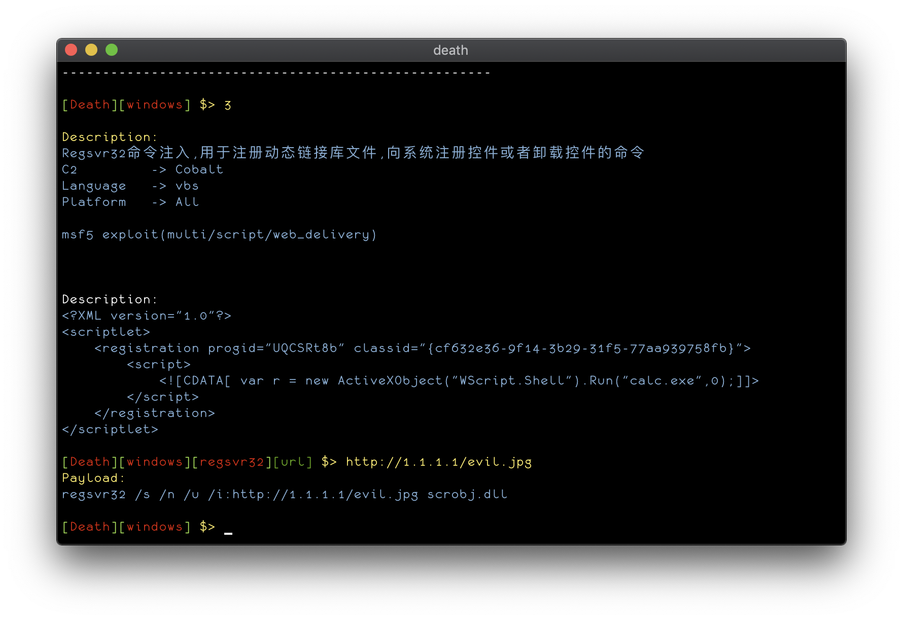
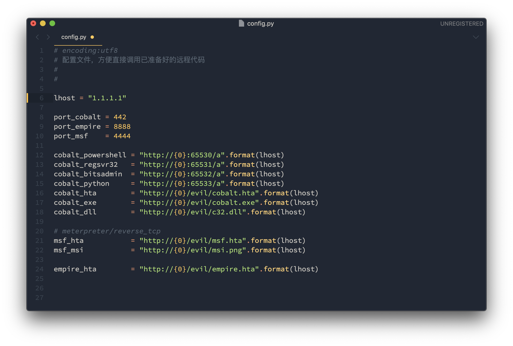
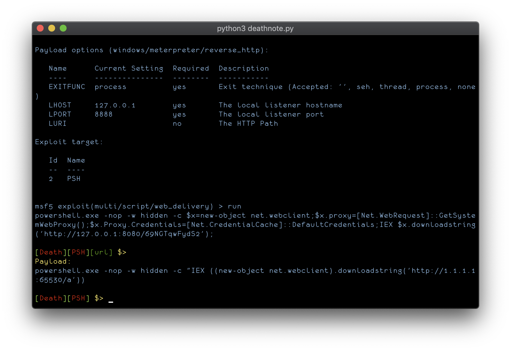

# DeathNote - Reverse Shell Cheat Sheet 

一个用于反弹shell的Cheat Sheet和后渗透的帮助笔记框架

 [](http://www.python.org/download/) [](http://www.python.org/download/) 








### Function
- windows 基于白名单的反弹shell及后渗透攻击

- linux 反弹shell

- powershell 攻击模块

- python 反弹shell

- msfvenom 查询


### Install
```
兼容py2和py3

git clone https://github.com/j3ers3/DeathNote

cd DeathNote

pip install -r requirements.txt

python death.py
```

### Config
配置modules/config.py文件


>修改lhost及port，可以使用默认配置，无需再输入url




### Help
```
help             show this help message
back             back
exit             exit  
quit             exit
```

### Donations
* XMR: `498AoZRwfC11Fa4LwAyVVp3wRD4Zyf1e1HziegczeWeSYVVTZ8gw8CoNPm5yhY91tkDqDMBg6A5KUfyowMtdkQDrDxE5aVN`
* BTC: `1ALWC7rGL4dHgbyy4R8uTVHmDugPDD7Rvt`

### Contact
- [Twitter](https://twitter.com/j3ers3)
